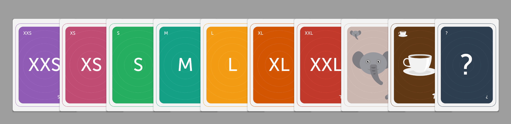
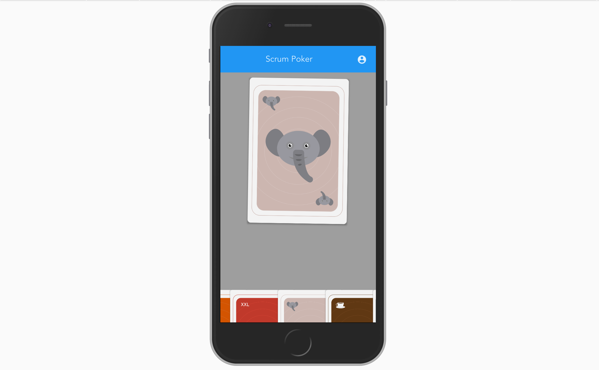

# ScrumPoker



> Planing poker game for Scrum.  
> This project comes from the need of having Scrum planing sessions with
> a Scrum team in multiple locations.

It allows us to estimate userstories in our team.


This project is built with [Vue.js](https://vuejs.org) + [VueMaterial](https://vuematerial.github.io/#/)

# How To
Every member of the team need to navigate from his phone to the url.
It will ask for a team and a name.
Then each member is able to select a card from the available deck.

You need to open the ScrumPoker Board from a desktop to see the estimations.
Once all the member have placed their estimations the ScrumMaster can turn the cards 
around to see the points estimated by the team.

In case there is a card that has no value like 'Elephant', 'Question mark' or 'Coffee Time'
it will not show any estimations, you need to re-estimate the user story.


# SetUp
This is a fully functional application, it provides you an example socket server
and a simulated API server.

It provides you 2 types of cards 'T-shirt sizes' and 'Fibonacci'. 
It also provides a setup to configure different teams, by default you have 
'Team-A' and 'Team-B'.

Every card value can have multiple reference stories that will show up on preselection
of a card.

You can configure these three things in by changing the files in `server/data/*.json`.
 
As said, this is just an example Socket and API server. If you want more power, like saving estimations
it's up to you to implement your own backend.

-------------------------------------------------------------------------------------------------------



 

# Dev Environment
The dev environment will fire the socket server and the api.


```
# install dependencies
npm install
	
# run dev environment and serves at localhost:10000
npm run dev

# build for production with minification
npm run build

```

This project is built on top of the official Vue.JS Webpack template. 
For detailed explanation on how things work, checkout the [guide](http://vuejs-templates.github.io/webpack/) and [docs for vue-loader](http://vuejs.github.io/vue-loader).


# Credits
Made with ❤️ by [@boudydegeer](https://twitter.com/boudydegeer), supported by [Coosto](https://www.coosto.com/en), [@coostodev](https://twitter.com/coostodev)